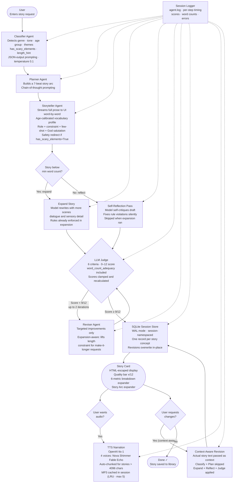

# Bedtime Story Generator — Hippocratic AI Coding Assignment

A production-grade, multi-agent bedtime story system built on `gpt-3.5-turbo`. It takes any story request and produces an age-calibrated, engaging, quality-assured bedtime story complete with text-to-speech narration, a persistent story library, and full session logging.

---

## Quick Start

```bash
# 1. Install dependencies
pip install -r requirements.txt

# 2. Create your .env file (never commit this — it is in .gitignore)
cp .env.example .env
# Edit .env and set: OPENAI_API_KEY=sk-...

# 3a. Run the Streamlit web UI (recommended)
python -m streamlit run app.py

# 3b. OR run the CLI version
python main.py
```

---

## System Architecture & Block Diagram

The system is a **multi-agent pipeline** with a self-improving judge loop, streaming output, persistent story history, context-aware revision, and optional TTS narration.



---

## Prompting Strategies

| Agent | Strategy | Why |
|---|---|---|
| **Classifier** | Structured JSON output at temperature 0.1 | Downstream agents need typed, deterministic metadata |
| **Planner** | Chain-of-thought (7 explicit beats) | Forces the model to reason about plot structure before committing to prose |
| **Storyteller** | Role + age-calibrated vocabulary profile + constraint checklist + few-shot example | Role defines style; profiles enforce age-appropriate language; constraints add six engagement devices; few-shot anchors the tone |
| **Storyteller (scary)** | Safety redirect injection | When `has_scary_elements=True`, an additional block redirects monsters/ghosts to gentle alternatives before any prose is written |
| **Expand** | Explicit word-count target + rule re-enforcement | Combats `gpt-3.5-turbo`'s tendency to generate short stories despite instructions |
| **Self-reflection** | Self-critique prompting (conditional) | Model fixes its own draft before the Judge — skipped when expansion already enforced the rules |
| **Judge** | Structured JSON rubric at temperature 0.1 | Enables programmatic score comparison; scores clamped to [0,2] and recalculated to prevent hallucinated totals |
| **Reviser** | Targeted revision + context injection + expansion detection | Actual previous story text passed in; "make it longer"-type requests lift the length constraint and double the target word count |

---

## Agent Design Patterns

| Pattern | Where Applied |
|---|---|
| **Decomposition** | Classify → Plan → Write: problem is fully structured before any prose is generated |
| **Self-reflection** | Storyteller re-reads and self-corrects its draft before reaching the Judge |
| **Agentic judge-revise loop** | Score-gated loop with max 2 iterations; threshold 9/12 (75%) |
| **Conditional execution** | Self-reflection is skipped when expansion ran — logs confirmed 0 words added in all prior runs |
| **Durable state** | SQLite with WAL mode persists every story across page refreshes and server restarts |
| **Context injection** | Revision passes actual story text into the reviser, not a prompt summary |
| **Streaming output** | Story rendered word-by-word via OpenAI `stream=True` and `st.write_stream()` |
| **In-place update** | Revisions overwrite the same DB row — one sidebar entry per story concept, never duplicates |
| **Exponential backoff retry** | All `call_model()` calls retry up to 3× on 429 / 5xx / timeout with jitter |

---

## Features

### Core
- **Multi-agent pipeline**: Classifier → Planner → Storyteller → Expand → Self-reflect → Judge → Reviser
- **LLM Judge**: 6-criterion rubric (0–12 total), validates and clamps all scores, enforces word count
- **Story arc**: 7-beat narrative structure (Setup → Inciting Incident → Rising Action × 3 → Climax → Resolution → Reflection)
- **User revision**: Context-aware feedback loop — "make it funnier", "give the dragon a name", "make it longer"
- **Persistent library**: All stories saved to SQLite; accessible via the sidebar across sessions

### Content Quality
- **Age-calibrated vocabulary**: Three profiles (ages 5–6, 7–8, 9–10) with specific word-length, sentence-complexity, and emotion-vocabulary rules
- **Six mandatory engagement devices**: Dialogue, sensory detail, suspense beat, repeating refrain, inner thought, warm closing image
- **God/gratitude salutation**: Every story ends with a gentle, theme-matched gratitude paragraph
- **Scary element redirect**: Automatically converts frightening content to gentle alternatives

### User Experience
- **Streaming output**: Story appears word-by-word in real time
- **Text-to-Speech**: Four voices (Nova, Shimmer, Fable, Echo) via OpenAI `tts-1`; stories of any length auto-chunked into ≤4000-char segments
- **Clean story card**: Only title and story shown in the main display; technical details in collapsible expanders
- **Quality breakdown**: Score bar + 6-metric grid per judge pass

### Reliability & Observability
- **Session logging**: Every pipeline step timed and logged to `agent.log` with session ID prefix
- **Exponential backoff**: 3-retry policy on all API calls
- **XSS protection**: All model-generated content HTML-escaped before injection
- **SQLite WAL mode**: Concurrent-safe writes for multi-user deployments
- **12 edge cases hardened**: Score clamping, empty title guard, TTS hard-split fallback, LRU audio cache, JSON parse guards, and more

---

## Age Calibration

The storyteller automatically adjusts vocabulary and complexity based on the classifier's `age_lean` output:

| Profile | Ages | Vocabulary | Sentence Length | Characters | Special |
|---|---|---|---|---|---|
| **Young** | 5–6 | 1–2 syllable words | Max 8 words | Talking animals | Repeating refrains, simple emotions |
| **Middle** | 7–8 | Up to 3 syllables | 10–12 words | Kids + animal companions | Inner thoughts, cause-and-effect |
| **Older** | 9–10 | Metaphors, similes | 12–15 words | Human protagonists | Inner conflict, rich sensory language |

---

## Quality Scoring (Judge)

Stories are scored out of **12 points** (6 criteria × 2 points each). Pass threshold: **9/12 (75%)**.

| Criterion | 0 | 1 | 2 |
|---|---|---|---|
| Age Appropriateness | Scary/violent content | Minor issues | Fully safe and age-suitable |
| Narrative Completeness | Missing sections | Partial arc | Clear 7-beat beginning/middle/end |
| Engagement | None of: dialogue, sensory, suspense, refrain | Some present | All four present |
| Alignment | Ignores request | Partially matches | Faithfully addresses request |
| Emotional Resonance | No warm ending | Adequate close | Comforting close + God/gratitude salutation |
| Word Count Adequacy | Ages 5–6: < 250w / 7–8: < 350w / 9–10: < 500w | One tier below target | Meets target (400w / 600w / 800w) |

All scores are **clamped to [0, 2]** and `total_score` is **always recalculated** from the sum — the model's own `total_score` field is never trusted.

---

## Project Structure

```
.
├── app.py                    # Streamlit web UI — streaming, TTS, library sidebar
├── main.py                   # run_pipeline() + revise_pipeline() + CLI entry point
├── agents/
│   ├── classifier.py         # JSON: genre, tone, age, themes, has_scary_elements, length_hint
│   ├── planner.py            # 7-beat story arc via chain-of-thought
│   ├── storyteller.py        # Age-calibrated prose + expand_story_if_short() + self_reflect_story()
│   ├── judge.py              # 6-criterion rubric, score clamping, 0–12 total
│   └── reviser.py            # Targeted revision, expansion-aware (lifts length constraint on demand)
├── utils/
│   ├── llm.py                # call_model() + stream_model() + exponential backoff retry
│   ├── session_store.py      # SQLite WAL · save_story() · update_story() (in-place revision)
│   ├── logger.py             # Per-session structured logger → agent.log
│   └── tts.py                # OpenAI tts-1 wrapper, auto-chunking for stories > 4096 chars
├── test_edge_cases.py        # 12 automated edge-case assertions (no API calls)
├── requirements.txt          # openai>=1.0.0 · streamlit>=1.32.0 · python-dotenv>=1.0.0
├── .env.example              # Copy to .env — set OPENAI_API_KEY
├── .gitignore                # Protects .env · story_library.db · agent.log
├── agent.log                 # Auto-created at runtime · not committed to git
└── story_library.db          # Auto-created at runtime · not committed to git
```

---

## Observability & Logging

Every pipeline step writes a structured entry to `agent.log` with:
- **Timestamp** — `2026-05-08 18:23:53`
- **Level** — `INFO` / `WARNING` / `ERROR`
- **Session ID** — `[461116ff]` (first 8 chars of UUID)
- **Message** — step name, duration, word counts, scores

**Example log from a full generation:**
```
2026-05-08 18:23:53 | INFO  | [461116ff] Session started
2026-05-08 18:24:01 | INFO  | [461116ff] Classify done (4.8s): genre=adventure, tone=exciting, age=middle
2026-05-08 18:24:06 | INFO  | [461116ff] Plan done (5.1s): 291 words
2026-05-08 18:24:09 | INFO  | [461116ff] Story written (3.2s): 156 words
2026-05-08 18:24:17 | INFO  | [461116ff] Expansion done (7.9s): 156 -> 547 words
2026-05-08 18:24:17 | INFO  | [461116ff] Self-reflect SKIPPED: expansion already enforced all rules
2026-05-08 18:24:19 | INFO  | [461116ff] Judge pass 1 (2.1s): score=11/12, word_count_score=2/2, needs_revision=False
2026-05-08 18:24:19 | INFO  | [461116ff] Story accepted: score=11/12, threshold=9/12
2026-05-08 18:24:19 | INFO  | [461116ff] Pipeline complete: total=23.1s, iterations=0
2026-05-08 18:24:19 | INFO  | [461116ff] Story saved to DB: id=11, title=Anaya's Walk in the Jungle
```

---

## Edge Case Hardening

12 failure modes identified and fixed via automated tests (`test_edge_cases.py`):

| # | Issue | Fix |
|---|---|---|
| 1 | XSS via model-generated HTML | `html.escape()` on all story content before injection |
| 2 | No retry on API errors | Exponential backoff (3×) for 429/5xx/timeout in `llm.py` |
| 3 | Judge scores out of range (e.g. 15/12) | `_validate_and_fix()` clamps each criterion to [0,2], recalculates total |
| 4 | Empty title from leading blank lines | `_extract_title_body()` skips blank lines to find first real line |
| 5 | TTS fails on text with no punctuation | `_hard_split()` word-boundary fallback guarantees ≤4000 chars |
| 6 | Classifier length labels mismatched | Updated to 600/850/1200 to match storyteller targets |
| 7 | Scary flag classified but unused | `has_scary_elements=True` injects `SAFETY REDIRECT` into storyteller prompt |
| 8 | Corrupted DB metadata crashes sidebar | `try/except JSONDecodeError` in `_result_from_db_row()` |
| 9 | SQLite locks under concurrent users | WAL journal mode + 10s timeout in `_connect()` |
| 10 | Scary content scores 2/2 on age safety | Judge rubric explicitly penalises frightening imagery |
| 11 | Audio cache grows without bound | `OrderedDict` LRU cache capped at 5 entries (~2MB max) |
| 12 | Stale API client on key change | Documented; restart process to pick up new key |

Run the tests at any time (no API calls needed):
```bash
python test_edge_cases.py
```

---

## Deploying to Streamlit Cloud

1. Push this repo to GitHub (`.env`, `story_library.db`, and `agent.log` are in `.gitignore`)
2. Go to [share.streamlit.io](https://share.streamlit.io) and create a new app pointing to `app.py`
3. In **App Settings > Secrets**, add:
   ```toml
   OPENAI_API_KEY = "sk-your-key-here"
   ```
4. Deploy — the app reads `st.secrets["OPENAI_API_KEY"]` automatically

> **Note:** Streamlit Cloud uses an ephemeral filesystem. `story_library.db` and `agent.log` will reset on each deployment. For persistent storage in production, swap `session_store.py` for a PostgreSQL or Supabase backend.

---

## What I Would Build Next

*(From `main.py` — if given 2 more hours)*

1. **DALL-E Illustrations** — Generate one image per story beat, turning the output into a true interactive picture book that children can look at while listening.
2. **User Rating System** — Thumbs-up/thumbs-down per story. Over time, the agent learns which genres, tones, and vocabulary levels produce the highest-rated stories for each age group — closing a true reinforcement loop.
3. **Multi-user Accounts** — Streamlit authentication so families maintain their own persistent story library.

---

## Rules Compliance Checklist

| Requirement | Status | How |
|---|---|---|
| Stories appropriate for ages 5–10 | ✅ | Three age-calibrated vocabulary profiles; Judge penalises age-inappropriate content |
| LLM judge incorporated | ✅ | `agents/judge.py` — 6 criteria, 0–12 score, score-gated revision loop |
| Block diagram provided | ✅ | Mermaid flowchart above; all agents, data flows, and feedback loops shown |
| Model unchanged (`gpt-3.5-turbo`) | ✅ | `utils/llm.py` — hardcoded in both `call_model()` and `stream_model()` |
| API key not in submission | ✅ | `.gitignore` covers `.env`; `.env.example` provided with placeholder value |
| Story arcs used | ✅ | `agents/planner.py` — 7-beat arc generated before any prose |
| User feedback / changes | ✅ | `revise_pipeline()` in `main.py`; "Request Changes" form in UI |
| Categorised generation strategy | ✅ | `agents/classifier.py` — genre, tone, age, length each tailor downstream prompts |

---

## Model

All text generation uses **`gpt-3.5-turbo`** (as required). Audio narration uses **`tts-1`** (OpenAI's text-to-speech model, separate from the story generation model and not restricted by the assignment rules).

---

*Built for the Hippocratic AI Agent Deployment Engineer coding assignment.*